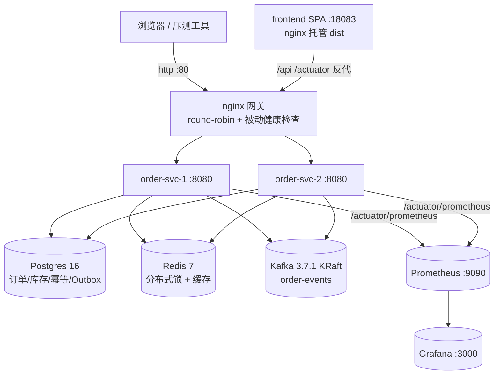
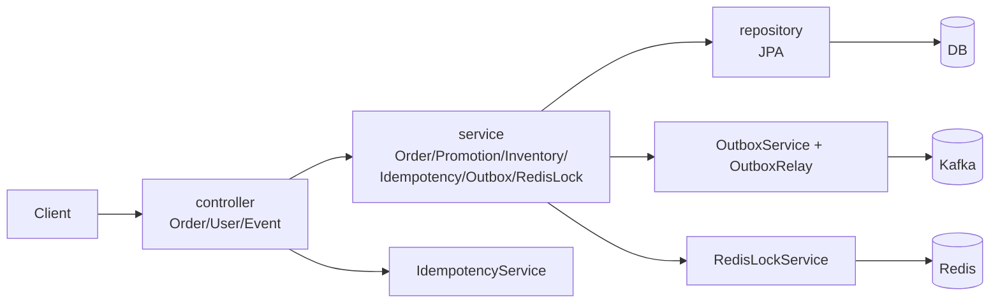
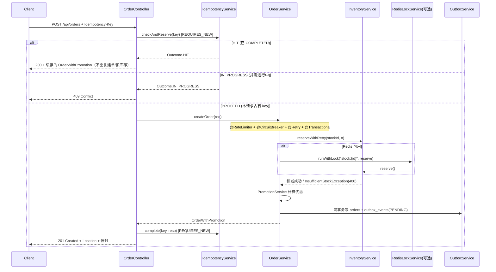
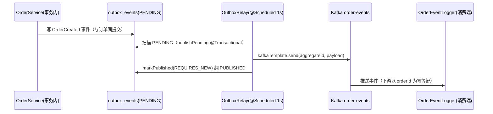

# Spring Order · 架构文档（ARCHITECTURE）

> 本文聚焦**设计、结构、数据流与关键决策**；运行方式、API 参数、促销规则等使用层内容见 [`README.md`](./README.md)。
> 项目定位：「订单 + 促销规则」后端，正逐步演进为**高并发分布式订单平台**（P0→P4）。

---

## 1. 设计目标

| 目标 | 实现方式 |
|------|----------|
| **零依赖可独立运行** | 默认内嵌 H2 文件库 + 内存结构，无 Docker 也能跑通与测试；一切中间件（Postgres / Redis / Kafka）均为**可选** |
| **优雅降级** | 中间件全部由 Spring Profile 驱动开关（`postgres` / `redis` / `kafka`），缺省关闭即退回纯 DB 行为 |
| **可水平扩展** | 服务无状态；多副本共享 Redis + Postgres + Kafka，由 nginx 网关负载均衡 |
| **一致性优先** | 库存用乐观锁杜绝超卖；事件用事务发件箱保证「落库 + 发消息」原子 |
| **可观测** | Actuator + Micrometer 暴露 `/actuator/prometheus`，Prometheus 抓两副本，Grafana 按实例拆分 |
| **可靠性** | `Idempotency-Key` 幂等 + Resilience4j 限流/熔断/重试，应对重试与流量突增 |

---

## 2. 部署拓扑

P4 全栈由 `docker-compose.yml` 一键编排，对外单一入口（nginx `:80`），背后 2 个 order-svc 无状态副本共享基础设施：

组件清单与职责：

| 服务 | 镜像 | 端口 | 职责 |
|------|------|------|------|
| `gateway` | nginx:1.27 | 80 | 反向代理 / 负载均衡（`conf/nginx.conf`，轮询 + `max_fails=3 fail_timeout=30s` 被动健康检查） |
| `order-svc-1` / `order-svc-2` | 本地构建（eclipse-temurin:17-jre） | 8081→8080 / 8082→8080 | 业务副本，无状态，共享 Redis/PG/Kafka |
| `db` | postgres:16 | 5432 | 持久化（JPA + Flyway） |
| `redis` | redis:7 | 6379 | 分布式锁（`RedisLockService`）+ 读缓存（`RedisCacheManager`） |
| `kafka` | apache/kafka:3.7.1 | 9092 | 单节点 KRaft，承载 `order-events` topic（Outbox 中继目标） |
| `prometheus` | prom/prometheus:v2.53.1 | 9090 | 抓取两副本 `/actuator/prometheus`（15s 间隔） |
| `grafana` | grafana/grafana:11.2.0 | 3000 | 看板（admin/admin，注入 Prometheus 数据源） |
| `frontend` | 本地构建（nginx 托管 dist） | 18083 | SPA，反代 `/api`、`/actuator` → 网关（同源无 CORS） |

> 端口说明：`:80/:3000/:5432/:6379/:9090` 为本机常见占用端口；`order-svc` 映射 8081/8082、`frontend` 用 18083 错开冲突。**前端与后端通过网关同源**，因此无跨域问题。

---

## 3. 后端分层架构

包命名空间 `com.example.order`（Java 示例占位，未改）。各层职责：

| 层 | 目录 | 关键类型 |
|----|------|----------|
| 入口 | `controller/` | `OrderController`（含 `Idempotency-Key` 处理）、`UserController`、`EventController` |
| 业务 | `service/` | `OrderService`、`PromotionService`、`InventoryService`、`IdempotencyService`、`OutboxService`、`OutboxRelay`、`RedisLockService`、`OrderEventLogger`（Kafka 示例消费者） |
| 模型 | `model/` | `Order`、`Inventory`、`User`、`CartItem`、`IdempotencyRecord`、`OutboxEvent`（`@Version` 乐观锁字段在此） |
| DTO | `dto/` | `OrderCreateRequest`、`OrderResponse`、`OrderWithPromotion`（下单信封）、`PromotionView`、`EventDto` |
| 异常 | `exception/` | `GlobalExceptionHandler` + `IdempotencyConflictException` / `InsufficientStockException` / `OrderNotFoundException` |
| 配置 | `config/` | `KafkaConfig`、`RedisConfig`、`WebConfig`、`InstanceInfoContributor`（暴露 `instanceId`） |
| 持久化 | `resources/db/migration/` | Flyway：`V1__init.sql`、`V2__idempotency.sql`、`V3__outbox.sql`（H2/PostgreSQL 兼容） |
| Profile 配置 | `resources/application-{postgres,redis,kafka}.yml` | 中间件连接，缺省不加载 |

---

## 4. 前端架构

- **技术**：React 18 + TypeScript + Vite 5 + React Router 6。
- **三页面**：`OrderPage`（下单 + 订单列表）、`UsersPage`（用户列表）、`StatusPage`（运行态：当前响应副本 `instanceId`、HTTP 指标、最近 Kafka 事件流）。
- **开发态 Mock**：`src/mocks/`（MSW 2.4）仅在 `import.meta.env.DEV` 启用，UI 自包含。
- **容器化**：`frontend/Dockerfile` 用 nginx 托管预编译 `dist`，`nginx.conf` 做 SPA history 回退并反代 `/api`、`/actuator` 到网关。
- **类型对齐**：`src/types/index.ts` 与后端契约保持一致（`discount` / `finalAmount` / `createdAt` / `EventDto` / `InstanceInfo`）。

---

## 5. 核心流程

### 5.1 下单全链路（含幂等）

`POST /api/orders` 的完整路径，幂等判定在 Controller 层、业务与库存扣减在 Service 层：

**幂等三态语义**（`IdempotencyService`，独立 `REQUIRES_NEW` 事务，唯一约束兜底并发插入）：

- `HIT` → 回放首次响应（200），不重复建单/扣库存；
- `IN_PROGRESS` → 返回 409，阻止双重提交；
- 业务失败 → `fail(key)` 删除记录，**释放 key** 供客户端用同一 key 安全重试。

### 5.2 Outbox 中继（at-least-once）

- **原子性**：事件在订单同一 DB 事务内写入，绝不会「落库成功却没发消息」。
- **at-least-once**：若中继在「发送成功 → 标记完成」间崩溃，事件下次轮询重发 → **下游必须幂等**（与 P2 呼应）。
- **不丢**：发送失败保持 `PENDING`，下次重试；Kafka 短暂宕机也不丢事件。
- **降级**：仅 `kafka` profile 装配 `OutboxRelay` / `KafkaConfig`；无 broker 时 `outbox_events` 留 `PENDING`。

### 5.3 查询路径（Redis 缓存）

- `OrderService.getOrder(id)` → `@Cacheable("orders", key=id)`
- `OrderService.getAllOrders()` → `@Cacheable("orders-all")`
- `createOrder(...)` → `@CacheEvict(cacheNames="orders-all", allEntries=true)` 失效列表缓存
- 序列化：`RedisConfig` 注入 `JavaTimeModule` 的 `ObjectMapper`，避免 `LocalDateTime` 反序列化失败（曾因缺失导致 500）。

### 5.4 网关负载均衡

`conf/nginx.conf` 用 `upstream order-svc` 轮询两副本；开源 nginx 仅支持**被动健康检查**（`max_fails=3 fail_timeout=30s`），单副本连续 3 次失败即踢出 30s，流量不中断。前端「运行态」页多次刷新可见 `/actuator/info` 的 `instanceId` 在副本间交替，直观验证轮询生效。

---

## 6. 数据模型

| 表 | 关键字段 | 说明 |
|----|----------|------|
| `orders` | `id`(PK,UUID) · `user_id` · `amount` · `discount` · `final_amount` · `status` · `created_at` | 订单主表；`existsByUserId` 推导「新用户首单」 |
| `inventory` | `stock_id`(PK) · `available` · `version` | `@Version` 乐观锁字段，并发扣减重试而非超卖 |
| `idempotency_keys` | `idempotency_key`(唯一) · `status`(IN_PROGRESS/COMPLETED) · `response_body` | 幂等表，零外部依赖，DB 级去重 |
| `outbox_events` | `aggregate_type` · `aggregate_id` · `event_type` · `payload`(TEXT) · `status`(PENDING/PUBLISHED) · `created_at` · `published_at` | 事务发件箱；`payload` 由 `@Lob` 改为 `TEXT`（规避 auto-commit 下 Large Object 不可读） |
| `users` | `id` · `name` · `email` | 5 个预置示例用户 |

---

## 7. 横切关注点

### 7.1 可靠性（P2）

- **幂等**：见 §5.1，DB 表实现（与 Redis 解耦——Redis 不可用也不影响幂等）。
- **Resilience4j**（实例名 `orderCreate`，Spring AOP 织入 `createOrder`）：
  - `@RateLimiter` 默认 10/s → 超限 `RequestNotPermitted` → **429**；
  - `@CircuitBreaker` 失败率 50% 开闸 5s → `CallNotPermittedException` → **503**（预期业务异常不计数）；
  - `@Retry` 最多 3 次，针对 `OptimisticLockingFailureException` / `DataAccessException`，跳过幂等冲突与库存不足。

### 7.2 一致性

- **库存**：`InventoryService.reserve()` 用 `@Transactional` + `@Version`；冲突抛 `OptimisticLockingFailureException`，`OrderService.reserveWithRetry` 最多重试 5 次。Redis 锁可用时串行化同 `stockId` 扣减，跨实例消除乐观锁风暴；未获取锁降级为纯 DB 乐观锁仍不超卖。
- **事件**：事务发件箱保证「状态更新」与「事件入队」原子（见 §5.2）。

### 7.3 缓存（P1）

Redis 可选；仅在 `redis` profile 启用 `@EnableCaching` + `RedisCacheManager`（JSON、5min TTL）。缺省不装配，`OrderService` 退回无缓存纯 DB。

### 7.4 可观测（P4）

- `/actuator/prometheus` 暴露 JVM / HTTP / Resilience4j 指标；`InstanceInfoContributor` 暴露 `instanceId`（副本主机名）展示网关轮询。
- `prometheus/prometheus.yml` 分别抓 `order-svc-1:8080` / `order-svc-2:8080`，Grafana 按 `instance` 标签拆分，直观看流量摊到两副本。

### 7.5 优雅降级（Profile 驱动）

| Profile | 启用能力 | 条件 |
|---------|----------|------|
| （默认） | H2 + 纯 DB 乐观锁 + 无缓存 + 无 Kafka | 零依赖，可跑可测 |
| `postgres` | 切真实 Postgres | `ORDER_DB_*` 环境变量 |
| `redis` | 分布式锁 + 读缓存 | `RedisConfig` `@ConditionalOnProperty(spring.data.redis.host)` |
| `kafka` | Outbox 中继 + 消费者 | `OutboxRelay` `@ConditionalOnProperty(spring.kafka.bootstrap-servers)` |

**健康检查坑（已修）**：`spring-boot-starter-data-redis` 在 classpath 上会自动注册 `RedisReactiveHealthIndicator`，与 `RedisConfig` 的 `@ConditionalOnProperty` **无关**——无 Redis 时恒 ping `localhost:6379` 失败，导致 `/actuator/health` 误报 `DOWN`。已在默认 `application.yml` 关 `management.health.redis.enabled`，仅 `redis` profile 开启。

---

## 8. 关键设计决策与权衡

| 决策 | 选择 | 理由 / 权衡 |
|------|------|------|
| 幂等存储 | **DB 表**而非 Redis | 与锁/缓存解耦；Redis 抖动不影响幂等正确性，零外部依赖即可验证 |
| 事件投递 | **事务发件箱**而非事务消息 / 双写 | 「落库 + 发消息」原子，at-least-once + 下游幂等，杜绝不一致 |
| 库存并发 | **乐观锁 + Redis 锁双保险** | 乐观锁保底不超卖；Redis 锁跨实例串行化、降重试风暴；取不到锁降级仍安全 |
| 网关 | **nginx 开源版** | 仅被动健康检查（无主动探活），对当前场景足够；若要主动健康检查需 NGINX Plus / 另配 |
| 健康检查 | 默认关 `redis` 指示器 | 避免无中间件时 health 误 DOWN |
| Kafka 镜像 | `apache/kafka` 而非 `bitnami/kafka` | 本机 CN 镜像源只代理 Docker Hub `library/*`，`bitnami/*` 拉不到；`apache/*` 经全量代理可达 |
| 监控镜像 | 固定 tag（`v2.53.1` / `11.2.0`） | `latest` 在受限网络拉取超时，pin 版本更稳 |
| 镜像构建 | 后端 COPY 宿主机 jar / 前端 COPY 宿主机 dist | 规避容器内 maven/npm 联网卡死（受限网络），构建更可靠 |

---

## 9. 演进回顾（P0→P4）

| 阶段 | 痛点 | 方案 | 状态 |
|------|------|------|------|
| **P0** | 内存存储重启丢；读后判断超卖 | JPA 持久化（H2/Postgres）+ Flyway + `@Version` 乐观锁 + 重试 | ✅ |
| **P1** | 单实例并发=单机 | 多实例 + Redis 分布式锁（`SET NX PX` + Lua 解锁）+ 读缓存 | ✅ |
| **P2** | 重试/重发重复下单 | `Idempotency-Key` 幂等表 + Resilience4j 限流/熔断/重试 | ✅ |
| **P3** | 下单同步耦合下游 | Kafka + 事务发件箱 Outbox（at-least-once，下游幂等） | ✅ |
| **P4** | 单入口 + 不可观测 | nginx 网关轮询 + Actuator/Prometheus/Grafana + 前端运行态页 | ✅ |

---

## 10. 后续方向（未覆盖）

- 真实下游消费者：履约 / 支付 / 通知 / 读模型，均以 `orderId` 为幂等键。
- 读写分离：订单写主库、列表/聚合走 Kafka 构建的读模型（CQRS）。
- 主动健康检查 / 蓝绿发布：替换开源 nginx 或外挂探针。
- 配置中心 / 服务发现：当前为静态 `docker-compose` 拓扑。
- 压测基线：见 `scripts/load-test.js`（k6）/ `load-test.py`（locust），多副本 + 网关下 RPS 随副本数近线性提升。
